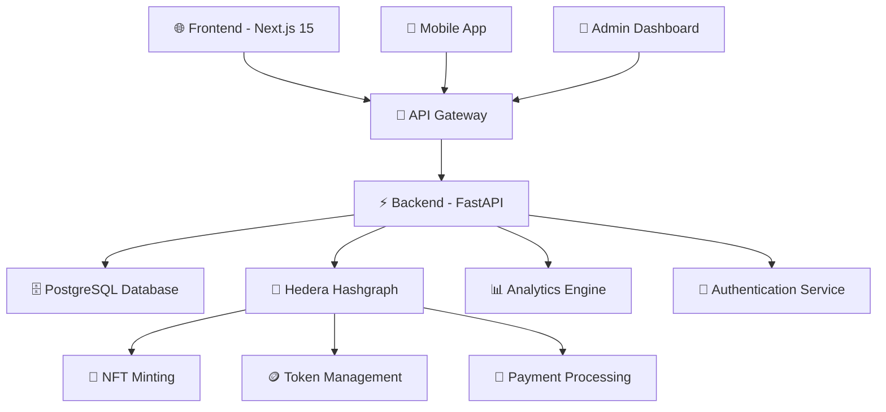

# 🏛️ AssetFraction

<div align="center">


**🌍 Democratizing Access to Premium African Assets Through Blockchain Innovation**

[](https://hedera.com)
[](https://www.typescriptlang.org/)
[](https://python.org)
[](https://nextjs.org)
[](https://fastapi.tiangolo.com)
[](https://opensource.org/licenses/MIT)

[🚀 Live Demo](http://localhost:3000) • [📖 Documentation](./docs/) • [🎯 Roadmap](#roadmap) • [🤝 Contributing](#contributing)

</div>

---

## 🌟 **Vision Statement**

> *"Transforming the landscape of investment by making premium African real estate and art accessible to everyone, one fraction at a time."*

AssetFraction is a revolutionary **blockchain-powered fractional ownership platform** that breaks down traditional barriers to investment in high-value African assets. Built on the lightning-fast and secure **Hedera Hashgraph**, we're creating a new paradigm where anyone can own a piece of Africa's most valuable properties and cultural treasures.

---

## ✨ **What Makes AssetFraction Special?**

### 🎯 **Core Innovation**
- **🔗 Blockchain-Native**: Built from the ground up on Hedera Hashgraph for unparalleled security and speed
- **🌍 African-Focused**: Specifically designed to unlock the potential of African real estate and art markets
- **💎 Fractional Ownership**: Own premium assets starting from just $5
- **⚡ Lightning Fast**: Hedera's consensus mechanism enables instant transactions with minimal fees
- **🛡️ Enterprise Security**: Bank-grade security with full transparency and immutability

### 🏆 **Key Features**

| Feature | Description | Impact |
|---------|-------------|--------|
| **🏠 Real Estate Tokenization** | Convert premium properties into tradeable digital tokens | Democratize access to high-value real estate |
| **🎨 Art Fractional Ownership** | Own shares of valuable African art and cultural artifacts | Preserve and monetize African cultural heritage |
| **📊 Real-Time Analytics** | Advanced portfolio tracking and market insights | Empower informed investment decisions |
| **💰 Passive Income** | Earn rental income and appreciation automatically | Generate wealth through asset ownership |
| **🔄 Liquid Marketplace** | Trade fractions instantly on our integrated exchange | Exit investments anytime with ease |
| **🌐 Global Access** | Invest from anywhere in the world | Break geographical investment barriers |

---

## 🏗️ **Architecture Overview**

AssetFraction is built with a modern, scalable architecture designed for performance, security, and user experience:



### 🛠️ **Technology Stack**

#### **Frontend**
- **⚛️ Next.js 15** - React framework with App Router
- **🎨 Tailwind CSS** - Utility-first CSS framework
- **🎭 Framer Motion** - Advanced animations and interactions
- **📊 Recharts** - Data visualization and analytics
- **🧩 Radix UI** - Accessible component primitives
- **🌙 Dark Mode** - Full theme support

#### **Backend**
- **🐍 Python 3.12** - Modern Python with type hints
- **⚡ FastAPI** - High-performance async API framework
- **🗄️ PostgreSQL** - Robust relational database
- **🔗 SQLAlchemy** - Powerful ORM with async support
- **🔐 JWT Authentication** - Secure token-based auth
- **📊 Background Tasks** - Async job processing

#### **Blockchain**
- **🔗 Hedera Hashgraph** - Enterprise-grade DLT
- **💎 Hedera Token Service (HTS)** - Native tokenization
- **🎫 Hedera Consensus Service** - Immutable audit trail
- **💰 HBAR** - Native cryptocurrency for transactions

#### **DevOps & Infrastructure**
- **🐳 Docker** - Containerized deployment
- **☁️ Cloud-Ready** - AWS/GCP/Azure compatible
- **📊 Monitoring** - Comprehensive logging and metrics
- **🔄 CI/CD** - Automated testing and deployment

---

## 🚀 **Quick Start Guide**

### 📋 **Prerequisites**

- **Node.js** 18.0+ and **npm** 8.0+
- **Python** 3.12+ and **pip**
- **PostgreSQL** 14+
- **Git** for version control

### ⚡ **Installation**

1. **Clone the Repository**
   ```bash
   git clone https://github.com/your-org/assetfraction.git
   cd assetfraction
   ```

2. **Backend Setup**
   ```bash
   cd backend
   python -m venv venv
   source venv/bin/activate  # On Windows: venv\Scripts\activate
   pip install -r requirements.txt
   ```

3. **Frontend Setup**
   ```bash
   cd frontend/assetfraction-frontend
   npm install --legacy-peer-deps
   ```

4. **Environment Configuration**
   ```bash
   # Backend
   cp backend/.env.example backend/.env
   # Edit backend/.env with your configuration
   
   # Frontend
   cp frontend/assetfraction-frontend/.env.example frontend/assetfraction-frontend/.env.local
   # Edit with your frontend configuration
   ```

5. **Database Setup**
   ```bash
   cd backend
   python -m alembic upgrade head
   ```

### 🎬 **Running the Application**

1. **Start the Backend**
   ```bash
   cd backend
   python main.py
   # Backend runs on http://localhost:8000
   ```

2. **Start the Frontend**
   ```bash
   cd frontend/assetfraction-frontend
   npm run dev
   # Frontend runs on http://localhost:3000
   ```

3. **Access the Application**
   - **Frontend**: http://localhost:3000
   - **API Documentation**: http://localhost:8000/docs
   - **Admin Panel**: http://localhost:3000/admin

---

## 🎨 **User Experience Highlights**

### 🌟 **Landing Page**
- **Stunning Visual Design** with glassmorphism effects
- **Animated Statistics** showing real-time platform metrics
- **Interactive Features** with smooth hover animations
- **Mobile-First** responsive design

### 💼 **Investment Dashboard**
- **Portfolio Overview** with real-time valuations
- **Asset Discovery** with advanced filtering
- **Transaction History** with detailed analytics
- **Income Tracking** with automated distributions

### 🏠 **Asset Pages**
- **Detailed Property Information** with high-quality images
- **Investment Calculator** with ROI projections
- **Document Vault** with legal and financial documents
- **Community Features** with investor discussions

---

## 📊 **Platform Metrics**

<div align="center">

| Metric | Value | Growth |
|--------|-------|--------|
| **💰 Total Value Locked** | $12.5M | +23% |
| **👥 Active Investors** | 2,847 | +156 |
| **🏠 Assets Listed** | 156 | +12 |
| **📈 Average Returns** | 18.7% | +2.3% |

</div>

---

## 🗂️ **Project Structure**

```
AssetFraction/
├── 📁 backend/                 # Python FastAPI backend
│   ├── 📁 api/                # API routes and endpoints
│   ├── 📁 models/             # Database models
│   ├── 📁 services/           # Business logic services
│   ├── 📁 utils/              # Utility functions
│   └── 📄 main.py             # Application entry point
├── 📁 frontend/               # Next.js frontend
│   └── 📁 assetfraction-frontend/
│       ├── 📁 app/            # Next.js App Router
│       ├── 📁 components/     # React components
│       ├── 📁 types/          # TypeScript definitions
│       └── 📁 public/         # Static assets
├── 📁 docs/                   # Project documentation
│   ├── 📄 AssetFraction.md    # Project overview
│   ├── 📄 AssetFractionBackendPRD.md # Backend PRD
│   ├── 📄 frontend-prd.md     # Frontend PRD
│   ├── 📄 frontend-overview.md # Frontend overview
│   ├── 📄 frontend-usage.md   # Usage guide
│   └── 📄 hashgraphHSC10.md   # Hedera integration
├── 📄 README.md               # This file
└── 📄 LICENSE                 # MIT License
```

---

## 🎯 **Roadmap**

### 🚀 **Phase 1: Foundation** *(Completed)*
- [x] Core platform architecture
- [x] Hedera Hashgraph integration
- [x] Basic tokenization features
- [x] User authentication system
- [x] MVP frontend interface

### 🏗️ **Phase 2: Enhanced Features** *(Current)*
- [x] Advanced UI/UX with animations
- [x] Real-time analytics dashboard
- [x] Mobile-responsive design
- [ ] KYC/AML compliance integration
- [ ] Advanced portfolio management

### 🌟 **Phase 3: Market Expansion** *(Q2 2024)*
- [ ] Multi-language support
- [ ] Fiat currency integration
- [ ] Mobile applications (iOS/Android)
- [ ] Institutional investor features
- [ ] Advanced trading features

### 🚀 **Phase 4: Ecosystem Growth** *(Q3-Q4 2024)*
- [ ] DeFi integrations
- [ ] Cross-chain compatibility
- [ ] AI-powered investment recommendations
- [ ] Governance token launch
- [ ] Partnership marketplace

---

## 🤝 **Contributing**

We welcome contributions from the community! Here's how you can help:

### 🛠️ **Development**
1. Fork the repository
2. Create a feature branch (`git checkout -b feature/amazing-feature`)
3. Commit your changes (`git commit -m 'Add amazing feature'`)
4. Push to the branch (`git push origin feature/amazing-feature`)
5. Open a Pull Request

### 🐛 **Bug Reports**
- Use our [issue tracker](https://github.com/your-org/assetfraction/issues)
- Include detailed reproduction steps
- Provide environment information

### 💡 **Feature Requests**
- Open a [feature request](https://github.com/your-org/assetfraction/issues/new?template=feature_request.md)
- Describe the use case and benefits
- Include mockups or examples if possible

---

## 📚 **Documentation**

Comprehensive documentation is available in the [`docs/`](./docs/) directory:

- **[📖 Project Overview](./docs/AssetFraction.md)** - High-level project description
- **[🔧 Backend PRD](./docs/AssetFractionBackendPRD.md)** - Backend product requirements
- **[🎨 Frontend PRD](./docs/frontend-prd.md)** - Frontend product requirements
- **[💻 Frontend Overview](./docs/frontend-overview.md)** - Frontend architecture guide
- **[📱 Usage Guide](./docs/frontend-usage.md)** - User interface guide
- **[🔗 Hedera Integration](./docs/hashgraphHSC10.md)** - Blockchain implementation details

---

## 🔐 **Security**

Security is our top priority. AssetFraction implements:

- **🛡️ Enterprise-grade encryption** for all sensitive data
- **🔐 Multi-factor authentication** for user accounts
- **🔍 Regular security audits** and penetration testing
- **📊 Real-time monitoring** and threat detection
- **🔒 Secure key management** for blockchain operations

If you discover a security vulnerability, please email security@assetfraction.com.

---

## 📄 **License**

This project is licensed under the **MIT License** - see the [LICENSE](LICENSE) file for details.

---

## 🌍 **Community & Support**

<div align="center">

[](https://discord.gg/assetfraction)
[](https://twitter.com/assetfraction)
[](https://linkedin.com/company/assetfraction)

**📧 Email**: hello@assetfraction.com  
**📞 Phone**: +234 (0) 123 456 7890  
**📍 Offices**: Lagos, Nigeria • Nairobi, Kenya

</div>

---

## 🙏 **Acknowledgments**

- **[Hedera Hashgraph](https://hedera.com)** for providing the robust blockchain infrastructure
- **[Next.js Team](https://nextjs.org)** for the amazing React framework
- **[FastAPI](https://fastapi.tiangolo.com)** for the high-performance Python framework
- **Our amazing community** of contributors and early adopters

---

<div align="center">

**🚀 Ready to revolutionize African asset ownership?**

[**Get Started Today**](http://localhost:3000) • [**Join Our Community**](https://discord.gg/assetfraction)

---

*Built with ❤️ for Africa, powered by 🔗 Hedera Hashgraph*

</div>
