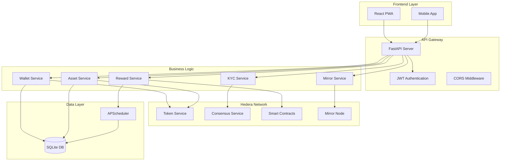

# 🏠 **AssetFraction Backend** 

<div align="center">


**Democratizing Real World Asset Ownership via Hedera**

[](https://python.org)
[](https://fastapi.tiangolo.com)
[](https://hedera.com)
[](https://sqlite.org)
[](LICENSE)

*Enabling fractional ownership of real estate and art starting from just $5*

[🚀 Quick Start](#-quick-start) • [📖 Documentation](#-api-documentation) • [🏗️ Architecture](#-architecture) • [🧪 Testing](#-testing) • [🤝 Contributing](#-contributing)

</div>

---

## 📌 **Overview**

AssetFraction Backend is a revolutionary **FastAPI-powered microservice** that enables the tokenization and fractional ownership of real-world assets (RWA) on the **Hedera network**. Built for the **Hedera African Hackathon**, this backend powers a platform that democratizes access to high-value assets like real estate and fine art.

### 🎯 **Key Features**

| Feature | Description | Technology |
|---------|-------------|------------|
| 🏠 **Asset Tokenization** | Convert real estate & art into NFTs + Fungible Tokens | HTS (Hedera Token Service) |
| 💰 **Fractional Ownership** | Enable ownership from as low as $5 | Custom FT implementation |
| 🔐 **KYC Integration** | Secure identity verification with HCS logging | HCS (Hedera Consensus Service) |
| 📊 **Income Distribution** | Automated rental/royalty payouts | Scheduled Transactions |
| 🔍 **Transparency** | Real-time transaction tracking | Mirror Node API |
| 💸 **Sponsored Wallets** | Zero-barrier user onboarding | Account Creation API |

---

## 🏗️ **Architecture**



---

## 🚀 **Quick Start**

### Prerequisites

- **Python 3.11+** 🐍
- **Node.js 18+** (for frontend integration)
- **Git** 
- **Hedera Testnet Account** with HBAR balance

### 1. Clone & Setup

```bash
# Clone the repository
git clone https://github.com/yourname/assetfraction-backend.git
cd AssetFraction/backend

# Create virtual environment
python -m venv venv

# Activate virtual environment
# On macOS/Linux:
source venv/bin/activate
# On Windows:
# venv\Scripts\activate

# Install dependencies
pip install -r requirements.txt
```

### 2. Environment Configuration

```bash
# Copy environment template
cp .env.example .env

# Edit configuration (use your favorite editor)
nano .env
```

**Required Environment Variables:**

```bash
# Hedera Network Configuration
HEDERA_NETWORK=testnet
OPERATOR_ID=0.0.YOUR_ACCOUNT_ID
OPERATOR_KEY=YOUR_PRIVATE_KEY_HERE
TREASURY_ID=0.0.TREASURY_ACCOUNT_ID
TREASURY_KEY=TREASURY_PRIVATE_KEY_HERE
HCS_TOPIC_ID=0.0.YOUR_TOPIC_ID

# Mirror Node API
MIRROR_NODE_API=https://testnet.mirrornode.hedera.com/api/v1

# JWT Configuration
JWT_SECRET=your-super-secret-jwt-key-change-in-production
JWT_ALGORITHM=HS256
ACCESS_TOKEN_EXPIRE_MINUTES=30

# Database
DATABASE_URL=sqlite:///./assetfraction.db

# API Configuration
API_HOST=0.0.0.0
API_PORT=8000
DEBUG=true
```

### 3. Initialize Database

```bash
# The database will be automatically created when you first run the server
# Tables are created using SQLAlchemy metadata
python -c "from database.database import engine, Base; Base.metadata.create_all(bind=engine); print('✅ Database initialized!')"
```

### 4. Run the Server

```bash
# Development mode (with auto-reload)
uvicorn main:app --reload --host 0.0.0.0 --port 8000

# Production mode
python main.py
```

### 5. Verify Installation

```bash
# Test the API
curl http://localhost:8000/health

# Expected response:
# {
#   "status": "healthy",
#   "database": "connected",
#   "scheduler": "running"
# }
```

### 6. Run Demo

```bash
# Execute the comprehensive API demo
python api_demo.py
```

---

## 📖 **API Documentation**

### 🔗 **Interactive Documentation**

Once the server is running, access the interactive API documentation:

- **Swagger UI**: http://localhost:8000/docs
- **ReDoc**: http://localhost:8000/redoc

### 🛠️ **Core Endpoints**

#### **Wallet Management**

| Method | Endpoint | Description | Auth Required |
|--------|----------|-------------|---------------|
| `POST` | `/api/v1/wallet/create` | Create sponsored Hedera wallet | ❌ |
| `GET` | `/api/v1/wallet/info/{wallet_id}` | Get wallet information | ❌ |
| `GET` | `/api/v1/wallet/balance/{wallet_id}` | Get HBAR balance | ❌ |
| `POST` | `/api/v1/wallet/transfer` | Transfer HBAR between accounts | ✅ |
| `GET` | `/api/v1/wallet/portfolio/{wallet_id}` | Get complete portfolio | ❌ |

#### **KYC Management**

| Method | Endpoint | Description | Auth Required |
|--------|----------|-------------|---------------|
| `POST` | `/api/v1/kyc/submit` | Submit KYC documents | ❌ |
| `GET` | `/api/v1/kyc/status/{wallet_id}` | Get KYC verification status | ❌ |
| `POST` | `/api/v1/kyc/verify/{submission_id}` | Verify KYC submission (admin) | ✅ |
| `GET` | `/api/v1/kyc/submissions` | List all KYC submissions (admin) | ✅ |

#### **Asset Tokenization**

| Method | Endpoint | Description | Auth Required |
|--------|----------|-------------|---------------|
| `POST` | `/api/v1/assets/tokenize` | Tokenize real estate/art asset | ✅ |
| `GET` | `/api/v1/assets/list` | List all tokenized assets | ❌ |
| `GET` | `/api/v1/assets/{asset_id}` | Get detailed asset information | ❌ |
| `POST` | `/api/v1/assets/{asset_id}/associate` | Associate user with asset token | ✅ |
| `POST` | `/api/v1/assets/{asset_id}/transfer` | Transfer asset tokens | ✅ |

#### **Income Distribution**

| Method | Endpoint | Description | Auth Required |
|--------|----------|-------------|---------------|
| `POST` | `/api/v1/rewards/schedule` | Schedule income distribution | ✅ |
| `GET` | `/api/v1/rewards/distributions` | List income distributions | ❌ |
| `GET` | `/api/v1/rewards/distributions/{id}` | Get distribution details | ❌ |
| `POST` | `/api/v1/rewards/distributions/{id}/execute` | Execute distribution now | ✅ |
| `GET` | `/api/v1/rewards/payouts/user/{wallet_id}` | Get user payouts | ❌ |
| `GET` | `/api/v1/rewards/analytics/asset/{asset_id}` | Get asset income analytics | ❌ |

#### **Mirror Node Integration**

| Method | Endpoint | Description | Auth Required |
|--------|----------|-------------|---------------|
| `GET` | `/api/v1/mirror/account/{account_id}` | Get account info from Mirror Node | ❌ |
| `GET` | `/api/v1/mirror/transactions/{account_id}` | Get transaction history | ❌ |
| `GET` | `/api/v1/mirror/tokens/{token_id}` | Get token information | ❌ |
| `GET` | `/api/v1/mirror/balances/{account_id}` | Get token balances | ❌ |
| `GET` | `/api/v1/mirror/portfolio/{account_id}` | Get portfolio summary | ❌ |

---

## 🗂️ **Project Structure**

```
backend/
├── 📁 api/                     # FastAPI routes and endpoints
│   ├── 📁 routes/
│   │   ├── wallet.py          # Wallet management endpoints
│   │   ├── kyc.py             # KYC verification endpoints
│   │   ├── assets.py          # Asset tokenization endpoints
│   │   ├── rewards.py         # Income distribution endpoints
│   │   └── mirror.py          # Mirror Node query endpoints
│   └── __init__.py
├── 📁 database/               # Database configuration
│   ├── database.py            # SQLAlchemy setup and session management
│   └── __init__.py
├── 📁 models/                 # SQLAlchemy ORM models
│   ├── models.py              # Database models (User, Asset, etc.)
│   └── __init__.py
├── 📁 schemas/                # Pydantic validation schemas
│   ├── schemas.py             # Request/response schemas
│   └── __init__.py
├── 📁 services/               # Business logic services
│   ├── hedera_service.py      # Hedera SDK integration
│   ├── mirror_service.py      # Mirror Node API client
│   ├── scheduler.py           # APScheduler for automated tasks
│   └── __init__.py
├── 📁 utils/                  # Utilities and helpers
│   ├── config.py              # Configuration management
│   ├── auth.py                # Authentication utilities
│   └── __init__.py
├── 📁 tests/                  # Test suite
│   ├── test_main.py           # Comprehensive test cases
│   └── __init__.py
├── 📄 main.py                 # FastAPI application entry point
├── 📄 api_demo.py             # Interactive API demonstration
├── 📄 requirements.txt        # Python dependencies
├── 📄 setup.py                # Package setup configuration
├── 📄 pyproject.toml          # Modern Python project configuration
├── 📄 .env                    # Environment variables (create from .env.example)
└── 📄 README.md               # This comprehensive documentation
```

---

## 🧪 **Testing**

### Run Test Suite

```bash
# Run all tests with verbose output
pytest tests/ -v

# Run tests with coverage report
pytest tests/ --cov=. --cov-report=html

# Run specific test file
pytest tests/test_main.py -v

# Run tests in parallel (faster)
pytest tests/ -n auto
```

### Test Coverage

The test suite covers:

- ✅ **API Endpoints** - All REST endpoints with various scenarios
- ✅ **Database Models** - ORM model creation and relationships
- ✅ **Services** - Hedera integration and Mirror Node queries
- ✅ **Authentication** - JWT token handling and user verification
- ✅ **Scheduler** - Income distribution automation
- ✅ **Error Handling** - Edge cases and error responses

### Manual Testing with Demo

```bash
# Run the interactive demo
python api_demo.py

# The demo will guide you through:
# 1. Creating sponsored wallets
# 2. Submitting KYC information
# 3. Checking balances
# 4. Tokenizing assets
# 5. Scheduling income distributions
# 6. Querying Mirror Node data
```

---

## 🔧 **Configuration**

### Environment Variables

| Variable | Description | Default | Required |
|----------|-------------|---------|----------|
| `HEDERA_NETWORK` | Hedera network (testnet/mainnet) | `testnet` | ✅ |
| `OPERATOR_ID` | Your Hedera account ID | - | ✅ |
| `OPERATOR_KEY` | Your Hedera private key | - | ✅ |
| `TREASURY_ID` | Treasury account for sponsoring | - | ✅ |
| `TREASURY_KEY` | Treasury private key | - | ✅ |
| `HCS_TOPIC_ID` | HCS topic for KYC logging | - | ✅ |
| `MIRROR_NODE_API` | Mirror Node API endpoint | Hedera testnet | ❌ |
| `JWT_SECRET` | JWT signing secret | - | ✅ |
| `DATABASE_URL` | SQLite database path | `sqlite:///./assetfraction.db` | ❌ |
| `API_HOST` | Server host | `0.0.0.0` | ❌ |
| `API_PORT` | Server port | `8000` | ❌ |
| `DEBUG` | Enable debug mode | `true` | ❌ |

### Hedera Network Setup

1. **Create Hedera Testnet Account**:
   - Visit [Hedera Portal](https://portal.hedera.com)
   - Create testnet account
   - Fund with testnet HBAR from [faucet](https://portal.hedera.com/faucet)

2. **Create HCS Topic**:
   ```bash
   # Using Hedera CLI or SDK
   hedera topic create --memo "AssetFraction KYC Topic"
   ```

3. **Configure Treasury Account**:
   - Create separate account for sponsoring user wallets
   - Fund with sufficient HBAR for operations

---

## 🚀 **Deployment**

### Docker Deployment

```dockerfile
# Dockerfile
FROM python:3.11-slim

WORKDIR /app

COPY requirements.txt .
RUN pip install --no-cache-dir -r requirements.txt

COPY . .

EXPOSE 8000

CMD ["uvicorn", "main:app", "--host", "0.0.0.0", "--port", "8000"]
```

```bash
# Build and run
docker build -t assetfraction-backend .
docker run -p 8000:8000 --env-file .env assetfraction-backend
```

### Production Deployment

```bash
# Install production dependencies
pip install gunicorn

# Run with Gunicorn
gunicorn main:app -w 4 -k uvicorn.workers.UvicornWorker --bind 0.0.0.0:8000

# Or use the production script
python main.py
```

### Environment-Specific Configurations

```bash
# Development
export DEBUG=true
export LOG_LEVEL=debug

# Staging
export DEBUG=false
export LOG_LEVEL=info
export HEDERA_NETWORK=testnet

# Production
export DEBUG=false
export LOG_LEVEL=warning
export HEDERA_NETWORK=mainnet
```

---

## 🔐 **Security**

### Best Practices Implemented

- 🔑 **JWT Authentication** - Secure token-based authentication
- 🔒 **Environment Variables** - Sensitive data stored in environment
- 🛡️ **Input Validation** - Pydantic schemas for request validation
- 🔐 **Password Hashing** - Bcrypt for secure password storage
- 🚫 **CORS Configuration** - Proper cross-origin request handling
- 📝 **Audit Logging** - HCS-based audit trail for KYC
- 🔍 **Rate Limiting** - Optional rate limiting for production

### Security Checklist

- [ ] Change default JWT secret in production
- [ ] Use HTTPS in production
- [ ] Implement rate limiting
- [ ] Set up monitoring and alerting
- [ ] Regular security audits
- [ ] Backup encryption keys securely
- [ ] Implement proper logging

---

## 📊 **Monitoring & Analytics**

### Health Monitoring

```bash
# Health check endpoint
curl http://localhost:8000/health

# Scheduler status
curl http://localhost:8000/api/v1/rewards/scheduler/jobs
```

### Metrics & Logging

The application provides comprehensive logging:

- 📊 **API Request Logs** - All HTTP requests and responses
- 🔄 **Scheduler Logs** - Income distribution execution
- 🔗 **Hedera Integration Logs** - Blockchain transaction logs
- ❌ **Error Logs** - Detailed error tracking

### Performance Monitoring

```python
# Add to your monitoring stack
import time
from fastapi import Request

@app.middleware("http")
async def add_process_time_header(request: Request, call_next):
    start_time = time.time()
    response = await call_next(request)
    process_time = time.time() - start_time
    response.headers["X-Process-Time"] = str(process_time)
    return response
```

---

## 🤝 **Contributing**

We welcome contributions! Here's how to get started:

### Development Setup

```bash
# Fork the repository
git clone https://github.com/yourusername/assetfraction-backend.git
cd AssetFraction/backend

# Create feature branch
git checkout -b feature/amazing-feature

# Install development dependencies
pip install -r requirements.txt
pip install -e ".[dev]"

# Run tests
pytest

# Make your changes and commit
git commit -m "Add amazing feature"
git push origin feature/amazing-feature
```

### Code Style

```bash
# Format code with Black
black .

# Lint with flake8
flake8 .

# Type checking with mypy
mypy .
```

### Pull Request Process

1. 🔄 **Fork & Branch** - Create feature branch from main
2. ✅ **Test** - Ensure all tests pass
3. 📝 **Document** - Update documentation if needed
4. 🔍 **Review** - Submit PR for review
5. 🚀 **Merge** - Merge after approval

---

## 📚 **Additional Resources**

### Hedera Documentation

- 📖 [Hedera Developer Portal](https://docs.hedera.com)
- 🔗 [Hedera SDK Python](https://github.com/hashgraph/hedera-sdk-python)
- 🏪 [HTS Token Service](https://docs.hedera.com/guides/docs/sdks/tokens)
- 💬 [HCS Consensus Service](https://docs.hedera.com/guides/docs/sdks/consensus)
- 🔍 [Mirror Node API](https://docs.hedera.com/guides/docs/mirror-node-api)

### FastAPI Resources

- ⚡ [FastAPI Documentation](https://fastapi.tiangolo.com)
- 🔒 [FastAPI Security](https://fastapi.tiangolo.com/tutorial/security/)
- 📊 [FastAPI Testing](https://fastapi.tiangolo.com/tutorial/testing/)

### Related Projects

- 🌐 [AssetFraction Frontend](../frontend) - React PWA frontend
- 📱 [AssetFraction Mobile](../mobile) - React Native mobile app
- 🔗 [Hedera Agent Kit](https://github.com/hedera-dev/hedera-agent-kit) - AI integration
- 📡 [HCS-10 OpenConvAI](https://github.com/hashgraph/hcs-10) - AI agent communication

---

## 📄 **License**

This project is licensed under the **MIT License** - see the [LICENSE](LICENSE) file for details.

---

## 🙏 **Acknowledgments**

- 🌟 **Hedera Team** - For the amazing blockchain platform
- 🏆 **Hedera African Hackathon** - For the opportunity and inspiration
- 🚀 **FastAPI Community** - For the excellent web framework
- 🐍 **Python Community** - For the robust ecosystem

---

## 📞 **Support**

Need help? We're here for you!

- 📧 **Email**: support@assetfraction.com
- 💬 **Discord**: [AssetFraction Community](https://discord.gg/assetfraction)
- 🐛 **Issues**: [GitHub Issues](https://github.com/yourname/assetfraction-backend/issues)
- 📖 **Documentation**: [Full Documentation](https://docs.assetfraction.com)

---

<div align="center">

**Made with ❤️ for the Hedera African Hackathon**

*Democratizing Real World Asset Ownership, One Fraction at a Time*

[](https://hedera.com)
[](https://python.org)
[](https://fastapi.tiangolo.com)

</div>
