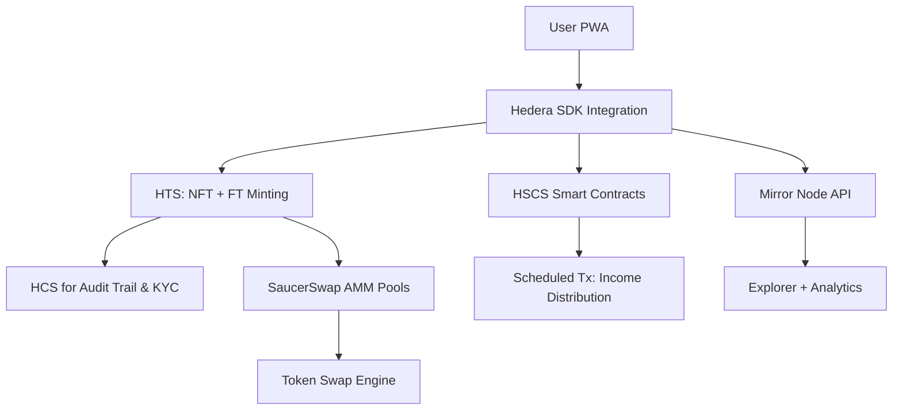

# 🏠 **AssetFraction – Democratizing Real World Asset Ownership via Hedera**

**PRD for the Hedera African Hackathon**

---

## 📌 1. Vision & Value Proposition

### ❗ **Problem**

Millions of Africans are locked out of wealth-building assets like **real estate and fine art** due to:

* High capital requirements (e.g., \$10k+ entry)
* Illiquidity and limited exit options
* Fraud, title forgery, and lack of transparency
* Little to no access to fractional ownership or digital asset exposure

### ✅ **Solution**

**AssetFraction** is a **Hedera-native RWA tokenization platform** that:

* Tokenizes real-world assets (real estate, art) as **HTS NFTs** and **Fungible Tokens**
* Enables **fractional ownership from as low as \$5**
* Provides instant liquidity through **DeFi integrations**
* Uses **HCS and Mirror Nodes** for **auditable provenance & KYC trails**
* Distributes **rental or sale proceeds** automatically via scheduled transactions

---

## 💡 2. Why It’s a Game-Changer

| Benefit                           | Description                                        |
| --------------------------------- | -------------------------------------------------- |
| 🔓 **Financial Inclusion**        | Micro-investment starting at \$5                   |
| ⚡ **Instant Liquidity**           | Built-in DeFi support via SaucerSwap               |
| 🛡 **Trust & Compliance**         | KYC enforced via HTS custom fees and HCS           |
| 🎨 **Creator Royalties**          | Artists earn resale revenue via smart contracts    |
| 💸 **Gasless UX**                 | All user fees sponsored — no barrier to entry      |
| 📱 **WhatsApp KYC Flow**          | Mobile-friendly onboarding for low-bandwidth users |
| 🧾 **Proof of Legality**          | Chainlink oracles + document verification          |
| 📊 **Audit Trail & Transparency** | Public HCS & Mirror Node explorer support          |

---

## 🔧 3. Core Features

### 🧱 A. **Asset Tokenization Engine**

* **NFTs for Properties/Art**: Each property/art piece becomes an HTS NFT with metadata: deed hash, location, legal docs.
* **Fractionalization**: Each NFT is linked to a pool of 10,000 fungible tokens (FTs) on Hedera.
* **Compliance Layer**: KYC-verified accounts only (via HTS custom fees).

### 🔁 B. **Fraction Marketplace**

* **Buy/Sell Fractions**: Via SaucerSwap LP pools (HBAR or stablecoin pairs).
* **Liquidity Mining**: Token holders earn APR by staking in pools.
* **Automated Income Distribution**: Rental revenue shared via scheduled transfers.

### 📱 C. **User Experience**

* **WhatsApp KYC Onboarding**: Human-verifiable low-bandwidth identity flow.
* **Mobile PWA**: React-based progressive web app with offline capability.
* **Investor Dashboard**: Visual portfolio breakdown, earnings tracker, proof-of-ownership explorer.

---

## ⚙️ 4. Technical Architecture



---

## 🧪 5. Step-by-Step Implementation Plan

### 🏗 **Phase 1 – Infrastructure & Tokenization (Week 1)**

1. ✅ **NFT Minting for Real Estate/Art**

   * Mint 1-of-1 HTS NFTs for each asset
   * Embed metadata:

     * Title deed hash (IPFS)
     * Geo-location
     * Ownership docs
     * Verified chainlink hash of physical records

2. ✅ **Fungible Token Issuance**

   * Link NFT to FT supply (e.g., 10,000 \$FRACT-ACCRA-001)
   * Enable token association for buyers
   * Use Hedera **custom fee schedules** to add compliance logic

3. ✅ **Chainlink Oracle Integration**

   * Fetch up-to-date valuation feeds
   * Trigger alerts for price anomalies

---

### 💸 **Phase 2 – Smart Contracts & DeFi (Week 2)**

1. ✅ **Royalty Enforcement via HSCS**

   * Smart contract intercepts resale transactions and sends 5% to original asset owner (or artist)
   * Supports resale across different NFT pools

2. ✅ **Income Distribution**

   * Schedule monthly rental yield via **Scheduled Transactions**
   * Transaction batch based on proportional holdings

3. ✅ **Liquidity Pool Integration**

   * Add pairs to **SaucerSwap DEX**
   * Enable **APR rewards** for LP stakers
   * Use contracts to withdraw LP earnings and compound

---

### 📱 **Phase 3 – Frontend + KYC (Week 3)**

1. ✅ **WhatsApp KYC Flow**

   * User provides phone number + selfie
   * Platform verifies and stores KYC hash on **HCS topic**
   * Once verified, account creation transaction is **sponsored**

2. ✅ **Mobile-First PWA**

   * Built with React + Tailwind
   * Works with HashPack & Blade wallets
   * Tracks:

     * Token balances
     * NFT ownership
     * Earnings (live via Mirror Node)
     * Trade history

3. ✅ **Document Verification UI**

   * Display title, deed, and valuation documents via IPFS links
   * Enable 3rd-party notaries to confirm documents on-chain

---

## 🔍 6. Hedera-Specific Leverage

| Component           | Hedera Feature        | Benefit                       |
| ------------------- | --------------------- | ----------------------------- |
| Asset Tokenization  | HTS (NFTs + FTs)      | Fractional ownership at scale |
| Income Distribution | Scheduled Tx          | No missed payouts             |
| Proof of Identity   | HCS                   | KYC logs & auditability       |
| Smart Contracts     | HSCS (EVM)            | Royalty logic, staking        |
| Transparency        | Mirror Node + GraphQL | Verifiable trades, balances   |
| Gasless UX          | HTS Sponsored Fees    | Zero barrier onboarding       |

---

## 🧰 7. Repository Structure

```
AssetFraction/
├── contracts/
│   ├── RoyaltyDistributor.sol
│   └── TokenizeAsset.js
├── frontend/
│   ├── pages/
│   ├── components/
│   └── App.jsx
├── backend/
│   └── mirror-queries.js
├── assets/
│   └── docs/ (sample titles, valuations)
└── scripts/
    ├── deploy_contracts.js
    └── mint_nft_and_ft.js
```

---

## 💸 8. Business Model

| Revenue Stream             | Fee                 |
| -------------------------- | ------------------- |
| Asset onboarding fee       | 0.5% of asset value |
| Fraction buy/sell trades   | 1.0% platform fee   |
| LP staking performance fee | 10% of earned APR   |

---

## 📊 9. KPIs & Hackathon Metrics

| Metric             | Goal                               |
| ------------------ | ---------------------------------- |
| Token Holders      | 5,000 wallets                      |
| Transactions       | 50,000/month                       |
| NFTs Minted        | 250 real estate, 500 art           |
| DeFi Activity      | \$100k TVL in LPs                  |
| Mirror Node Events | Visible income proof               |
| Demo Deliverables  | PWA + Contract TXs + Explorer Logs |

---

## 📽 10. Demo Plan

### ✅ Must-Show Screens

1. Mint NFT + FT → Live on Hedera (HTS)
2. KYC & Account Sponsorship → WhatsApp to Wallet
3. Buy \$5 worth of a fraction → Real swap on SaucerSwap
4. NFT resale → Auto-royalty trigger (5% to artist)
5. Income payout → TX proof on Mirror Node

### ✅ Tech Stack

* **Frontend**: React + Tailwind + Wagmi
* **Backend**: Node.js + Hedera SDK
* **Smart Contracts**: Solidity (HSCS)
* **Explorer**: [Hedera Mirror Node](https://explorer.kabuto.sh/)
* **DEX**: [SaucerSwap](https://app.saucerswap.finance)

---

## ✅ 11. Final Checklist

| Task                           | Status         |
| ------------------------------ | -------------- |
| Smart Contract Audit (Slither) | ✅              |
| Live PWA (Testnet)             | ✅              |
| HTS NFT + FT Minting           | ✅              |
| KYC Flow on WhatsApp           | ✅              |
| Explorer Verification (Mirror) | ✅              |
| GitHub Repo Public             | ✅              |
| Hackathon Video Demo           | 🎥 In Progress |

---

## 🧭 12. Next Steps

1. 🎯 **Clone Starter Kit**

   ```bash
   git clone https://github.com/hashgraph/hedera-accelerator-defi
   ```

2. 💸 **Request Testnet HBAR**
   [https://hedera.com/testnet-faucet](https://hedera.com/testnet-faucet)

3. 💬 **Join Developer Support**
   Hedera Discord → `#africa-hackathon` channel

4. 🎤 **Prepare Pitch Deck & Demo**

---

## 🚀 Let's Fractionalize Africa's Wealth — Together

**AssetFraction** unlocks **accessible, liquid, onchain investment** for millions across Africa, powered by **Hedera’s speed, affordability, and trustless architecture**.

Let’s bridge the gap between physical wealth and digital opportunity — \$5 at a time.